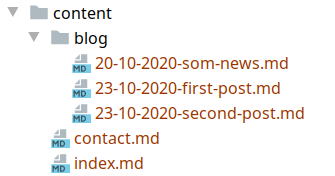

# Техническое задание

## Разработать приложение для решения следующей задачи.

Дан каталог ***content*** имеющий следующую структуру:

0. создать класс ___App___ который должен иметь следующие методы:
    - getFileList($dir) *-> возвращает массив файлов в указанном каталоге $dir*
    - getFileContent($file) *-> возвращает содержимое указанного файла $file*
    - getUri() *-> возвращает URI*
    - parseUri($uri) *-> возвращает массив из элементов URI*
    - getDirList($dir) *-> возвращает массив директорий в указанном каталоге $dir*
    - main() *-> главный метод выполняющий всю логику приложения*

1. Приложение должно реализавать следующую логику
   - должно отслеживать содержание URL и парсить содержимое URI в массив
   - если URI[0] пустой возвращать значение файла index.md
   - иначе проверить сущиствование файла совподающего со значением в URI[0]
        1. если файл существует вывести его содержимое на сайт
        2. иначе вернуть ошибку ***404***
   - если URI[0] = 'blog'  получить список файлов из каталога ___blog___ и вывести краткое содержание записей со ссылкой на прочтение полного материала (ссылка должна иметь вид -> /blog/20-10-2020-som-news.html)
   -если URI имеет следующий вид /blog/ ___имя файла___ .html проверить существование файла и вывести его содержимое на сайт

2. файл страница должен соответствовать следующим требованиям :
    1. основное контент хранится в формате ***MarkDown***
    2. в файле должна присутствовать секция в формате **JSON** содержащая - Заголовок, дату публикации, вводный текст поста и ссылку на изображение к вводному тексту.
3. В проекте необходимо использовать шаблонизатор [***TWIG***](https://twig.symfony.com/doc/3.x/installation.html)
4. Markdown парсить используя библиотеку [***erusev/parsedown***](https://github.com/erusev/parsedown)
